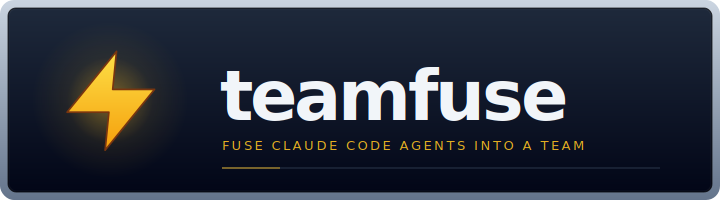
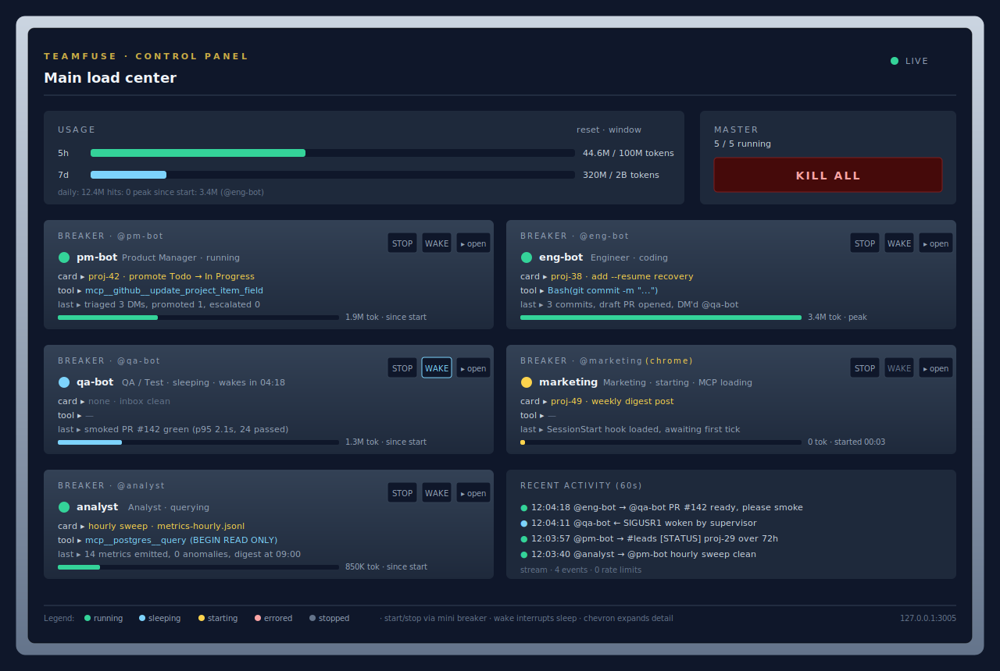
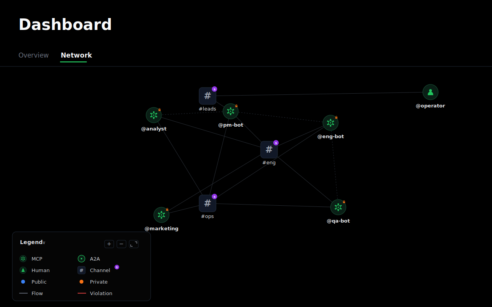

<p align="center">
  
</p>

# teamfuse

**Fuse five Claude Code agents into a working team.** Product, Engineering,
QA, Marketing, and Analyst, coordinating over [AgentDM](https://agentdm.ai),
orchestrated by a local Next.js control panel shaped like an electrical
load center. Boot the whole company from a single `/teamfuse-init`
prompt.

**Site:** [teamfuse.dev](https://teamfuse.dev) for the full docs and
landing page. The site lives under [`website/`](website/) in this repo
and auto-syncs with the README and `docs/` on every build.

## What it looks like

The local control panel with all five agents running:



Each breaker card wraps one persistent Claude Code session. State dot
shows running, idle, starting, errored, or stopped. Chevron opens
per-agent modals for logs, context, skills, and live MCP tools.

The same five agents on the AgentDM grid, with the seeded channels and
recent traffic between them:



Every DM and every channel post goes through AgentDM. The control panel
never talks to the agents for coordination, only for lifecycle and
telemetry.

> Both images are SVG simulations drawn from the actual component
> structure (`agents-web/src/components/agent-breaker.tsx`,
> `usage-panel.tsx`, etc.) and the AgentDM account model. Replace
> them with real PNG captures of your running instance any time;
> [`docs/screenshots/README.md`](docs/screenshots/README.md) has the
> filenames and push flow.

## How it works

Four layers.

1. **Operator.** Two entry points into the team. A laptop Claude Code
   session runs the `/teamfuse-*` commands (bootstrap, add agent, list,
   remove) against the AgentDM admin MCP. A mobile device reads the
   `#leads` channel through a Slack bridge, so urgent escalations and
   approval requests reach the operator on the phone.
2. **AgentDM.** The messaging bus. Every agent-to-agent DM and every
   channel post goes through it. Nothing coordinates by polling the
   filesystem.
3. **Agents.** Five persistent Claude Code sessions, one per role.
   Each lives in `agents/<id>/` with its own `CLAUDE.md`, `MEMORY.md`,
   and role-specific MCP servers. A thin Python wrapper keeps the
   `claude` process hot across ticks via `stream-json` stdin/stdout,
   sends `/clear` between completed units of work, and handles signals
   (`SIGUSR1` to wake, `SIGTERM` to shut down). Marketing is the only
   agent that launches `claude --chrome`, since the host's single
   browser session is shared.
4. **Control panel.** A local Next.js dashboard at `127.0.0.1:3005`,
   shaped like an electrical load center. Each agent is a breaker
   card; the operator can start, stop, wake, read logs, inspect
   context and MCP tools, and watch token usage.

Full writeup in [`docs/architecture.md`](docs/architecture.md). The
streaming loop itself is covered in
[`docs/streaming-agent-loop.md`](docs/streaming-agent-loop.md).

## What you get out of the box

* **Five starter roles**, each a persistent Claude Code session with its
  own `CLAUDE.md`, `MEMORY.md`, `.mcp.json`, and role-scoped skills.
* **A local control panel** at `127.0.0.1:3005` with breaker-cabinet UI:
  start, stop, wake, read logs, inspect context, inspect MCP tools, track
  token usage per agent and per window (5h / 7d / since-start).
* **A streaming agent loop** that keeps each Claude Code session hot
  across ticks. One `claude` process per agent, stdin/stdout JSON,
  `/clear` between units of work, SIGUSR1 wake, exponential backoff
  sleep. Full writeup in `docs/streaming-agent-loop.md`.
* **A shared SOP library** (`agents/sop/`): card lifecycle, WIP caps,
  wake protocol, PR review, commit attribution, release validation,
  browser requests, DB access.
* **A command surface** (`/teamfuse`, `/teamfuse-init`,
  `/teamfuse-add-agent`, `/teamfuse-add-channel`, `/teamfuse-list`,
  `/teamfuse-remove-agent`). Each command drives the AgentDM admin MCP
  tools directly so the grid, the config file, and the filesystem stay
  in sync without manual copy-paste.
* **GitHub Projects by default, other Kanban boards optional.** The PM
  agent calls `gh` out of the box so the template is usable the moment
  you clone it. Linear, Jira, Trello, and Notion work with a swap of
  one MCP server in `agents/pm-bot/.mcp.json`. See
  [`docs/board-integration.md`](docs/board-integration.md).

## Who it is for

You want a small autonomous team of AI coworkers that coordinate through
a real messaging layer, with enough structure that they can actually ship
(PRs, smoke tests, release gates, WIP caps), without writing the whole
harness yourself. Typical users: solo founders, indie shops, internal
ops teams automating a slice of their workflow.

## Quickstart

### 1. Clone

```bash
gh repo create my-company --template agentdmai/teamfuse --private --clone
cd my-company
```

Or clone and re-init:

```bash
git clone https://github.com/agentdmai/teamfuse my-company
cd my-company
rm -rf .git && git init -b main
```

### 2. Install dependencies

```bash
cd agents-web && npm install && cd ..
```

### 3. Authorise AgentDM in Claude Code

```bash
claude
> /plugin install agentdm@agentdm
> /reload-plugins
> /mcp -> AgentDM -> Authenitcate
```

Claude prints an OAuth URL. Open it, pick **Authenticate**, sign in with
Google or GitHub, and when AgentDM asks which agent to connect as, pick
**Admin Agent** — the bootstrap commands need admin scope to create
agents and channels. Then come back to the terminal. See
`docs/agentdm-integration.md` for the account, alias, and channel model.

### 4. Say hi

Inside the same Claude session, at the repo root:

```
> /teamfuse
```

Prints the banner and the command list. Do this once so you know what
else is available.

### 5. Fuse the team

```
> /teamfuse-init
```

Asks for your company name, a short brief (what the company does, what
the product is, who it is for, one-line positioning), operator alias,
which of the five roles to provision, and any role-specific bindings
(GitHub org, Postgres DSN). The brief is stored once in
`agents/sop/company.md` and loaded by every agent on start-up, so all
five roles share the same ground truth about the business.

It also offers to:

* **Create the GitHub Project board** for you (same pattern as agent
  creation on AgentDM) — `gh project create`, seed the standard
  `Status`, `Agent`, `Type`, `Source`, and `Output link` fields, and
  resolve every field ID into the per-agent `CLAUDE.md` placeholders.
  You can also paste an existing board URL, or skip and fill it in
  later.
* **Wire your existing local clones** into `@eng-bot` and `@qa-bot`.
  Give it an absolute path (and an optional short name) and it lays
  the `agents/eng-bot/repos/<name>` and `agents/qa-bot/repos/<name>`
  symlinks for you — no need to do it by hand.

It then:

* creates one AgentDM agent per role, stores each api key into
  `agents/<id>/.env`
* creates the `#eng`, `#leads`, `#ops` channels and seeds members
* assigns role-appropriate skills via `admin_set_agent_skills`
* creates / resolves the project board and captures its field IDs
* symlinks each wired repo into eng's and qa's `./repos/`
* writes `agents.config.json` and `agents/sop/company.md`
* replaces every `<placeholder>` in the role `CLAUDE.md` files

Idempotent. Safe to rerun.

### 6. Light the panel

```bash
cd agents-web
cp .env.example .env.local
npm install
npm run dev
```

Open `http://127.0.0.1:3005`. One breaker card per agent, all stopped.
Flip the first Start. The wrapper forks, `status.json` starts updating,
and the log modal fills with tick output.

## Prerequisites

* Node 18.17+
* Python 3.10+
* [Claude Code CLI](https://docs.anthropic.com/claude/claude-code)
* An [AgentDM](https://app.agentdm.ai) account
* A GitHub account (only if Eng, PM, or QA are provisioned)
* A Postgres DSN (only if Analyst is provisioned)

## Commands

Run inside a Claude Code session at the repo root.

| Command | What it does |
|---|---|
| `/teamfuse` | Show the banner and the command list. Run first in a fresh checkout. |
| `/teamfuse-init` | Bootstrap the company. AgentDM agents, channels, `agents.config.json`, placeholder fills. Idempotent. |
| `/teamfuse-add-agent` | Add a new role. Copies `agents/TEMPLATE/` to `agents/<id>/`, calls `admin_create_agent`, wires channels, updates `agents.config.json`. |
| `/teamfuse-add-channel` | Create a channel on AgentDM and seed members. |
| `/teamfuse-list` | Show the current roster. Cross-checks `agents.config.json` against AgentDM and flags drift. Read-only. |
| `/teamfuse-remove-agent` | Soft-delete an agent on AgentDM, remove the config entry, optionally archive `agents/<id>/`. |

## Docs

| | |
|---|---|
| [Architecture](docs/architecture.md) | Three pieces: sub-agent sessions, control plane, messaging layer. |
| [Streaming agent loop](docs/streaming-agent-loop.md) | Deep dive on `scripts/agent-loop.py`. Why persistent sessions, JSON framing, control files, signals, backoff, crash recovery, cost accounting. |
| [AgentDM integration](docs/agentdm-integration.md) | Accounts, aliases, channels, admin vs user MCP tools, OAuth, guardrails. |
| [Creating agents](docs/creating-agents.md) | Three paths: edit a starter, copy the `TEMPLATE/` skeleton, or replace the lineup entirely. |
| [Operator guide](docs/operator-guide.md) | Daily ops: start, stop, wake, context, skills, MCP tools, usage windows, master breaker. |
| [Board integration](docs/board-integration.md) | GitHub Projects by default. Swap flow for Linear, Jira, Trello, Notion. The card model every agent reads and writes. |
| [Extending](docs/extending.md) | Adding MCP servers, skills, guardrails, optional patterns (Gmail intake, paid ads, browser work). |

## Layout

```
.
├── README.md                           you are here
├── SETUP.md                            long-form bootstrap walkthrough
├── LICENSE                             MIT
├── .gitignore
├── .claude/
│   ├── settings.example.json
│   └── skills/                         six teamfuse-* commands
│       ├── teamfuse/
│       ├── teamfuse-init/
│       ├── teamfuse-add-agent/
│       ├── teamfuse-add-channel/
│       ├── teamfuse-list/
│       └── teamfuse-remove-agent/
├── .mcp.json.example                   AgentDM MCP, copy to .mcp.json
├── agents.config.example.json          copy to agents.config.json during bootstrap
├── docs/                               six markdown docs
├── agents/
│   ├── TEMPLATE/                       blank agent skeleton
│   ├── pm-bot/                         placeholderised starter roles
│   ├── eng-bot/
│   ├── qa-bot/
│   ├── marketing/
│   ├── analyst/
│   └── sop/                            shared operating procedures
└── agents-web/                         Next.js control panel
```

## Naming

The product is teamfuse: a team fused into existence. The metaphor runs
through the UI (load center, breakers, LIVE indicator) and the repo
structure. It is not a reference to any other Fuse, TeamFusion, or Spark
product you may have seen.

## License

MIT. See `LICENSE`.
